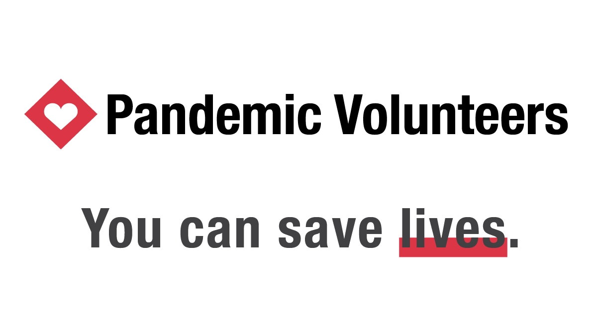

<div align="center" style="object-fit: contain">
    
</div>

# ⚠️ Help Wanted

Please help building and managing [Pandemic Volunteers](https://pandemicvolunteers.org).

Ruby on Rails developers and staff to interview applicants are especially needed.

Get in touch via email: `contact@pandemicvolunteers.org`


# 🕵️ Looking for Feedback

Please have a look at https://pandemicvolunteers.org

Feedback from doctors, medical workers and more would be really appreciated.

Get in touch via email: `contact@pandemicvolunteers.org`

# 👩‍💻 Development

Instructions below are for macOS.

## Prerequisites

* [Homebrew](https://brew.sh/):

```sh
bash -c "$(curl -fsSL https://raw.githubusercontent.com/Homebrew/install/master/install.sh)"
```

* [rvm](https://rvm.io/rvm/install):

```sh
gpg --keyserver hkp://pool.sks-keyservers.net --recv-keys 409B6B1796C275462A1703113804BB82D39DC0E3 7D2BAF1CF37B13E2069D6956105BD0E739499BDB
curl -sSL https://get.rvm.io | bash -s stable --ruby
```

## Setup

### Fork this project

Fork your own copy of hantuzun/pandemic-volunteers to your account.
Run the command below in your repository.

```sh
$ git clone https://github.com/your-account/pandemic-volunteers

$ cd pandemic-volunteers
```

### Install Ruby 2.7.0

```sh
$ rvm install 2.7.0

$ rvm use --default 2.7.0

$ ruby --version
```

Your ruby version output should begin with `ruby 2.7.0`.


### Install required dependencies

```sh
$ brew install yarn

$ brew install postgresql

$ gem install bundler

$ gem install foreman
```

### Install 

```sh

$ bundle install
...
```

## Run

Run PostgreSQL. It is required for you to develop the application on your local machine.

```sh
$ brew services start postgresql
```

Run the project:

```sh
$ foreman start
```

On your first time running the project, and whenever the DB schema is updated, you need to update your local DB with the following command:

```sh
$ rails db:migrate
```

Visit http://localhost:3000
